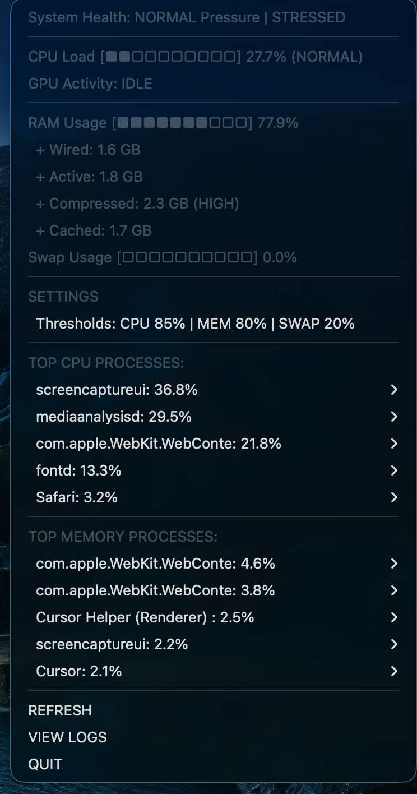

# Monarx

A lightweight cross-platform system tray application for monitoring CPU, Memory, and Swap usage.

## Supported Platforms

| Platform | Status |
|----------|--------|
| macOS    | ✅ Ready |
| Windows  | 🚧 Coming Soon |
| Linux    | 🚧 Coming Soon |

## Features

- Live system stats in system tray
- Native notifications when thresholds exceeded
- Configurable thresholds
- Minimal and clean interface

## Installation

### macOS

```bash
cd ~/tools/Monarx
python3 -m venv .venv
source .venv/bin/activate
pip install psutil rumps pyobjc
```

### Windows / Linux (Coming Soon)

```bash
pip install psutil pystray pillow
```

## Usage

```bash
python main.py
```

## Configuration

Edit `config.py`:

```python
CPU_LIMIT = 85      # Alert when CPU exceeds this %
MEM_LIMIT = 80      # Alert when Memory exceeds this %
SWAP_LIMIT = 20     # Alert when Swap exceeds this %
CHECK_EVERY = 5     # Refresh interval (seconds)
COOLDOWN = 120      # Time between repeated notifications
```

## Display

Shows: `C:XX M:XX S:XX`

- **C** = CPU %
- **M** = Memory %
- **S** = Swap %

## Project Structure

```
Monarx/
├── main.py          # Entry point (auto-detects platform)
├── core/            # Platform-agnostic monitoring logic
│   ├── config.py    # Configuration
│   └── logging.py   # Logging setup
├── mac/             # macOS implementation
├── windows/         # Windows implementation (stub)
└── linux/           # Linux implementation (stub)
```

## Auto-Start (macOS)

Create `~/Library/LaunchAgents/com.monarx.plist`:

```xml
<?xml version="1.0" encoding="UTF-8"?>
<!DOCTYPE plist PUBLIC "-//Apple//DTD PLIST 1.0//EN" "http://www.apple.com/DTDs/PropertyList-1.0.dtd">
<plist version="1.0">
<dict>
    <key>Label</key>
    <string>com.monarx</string>
    <key>ProgramArguments</key>
    <array>
        <string>/Users/dineshkorukonda/tools/Monarx/.venv/bin/python</string>
        <string>/Users/dineshkorukonda/tools/Monarx/main.py</string>
    </array>
    <key>WorkingDirectory</key>
    <string>/Users/dineshkorukonda/tools/Monarx</string>
    <key>RunAtLoad</key>
    <true/>
    <key>KeepAlive</key>
    <true/>
    <key>StandardOutPath</key>
    <string>/Users/dineshkorukonda/tools/Monarx/monitor.log</string>
    <key>StandardErrorPath</key>
    <string>/Users/dineshkorukonda/tools/Monarx/monitor.err</string>
</dict>
</plist>
```

Load and start the agent:

```bash
launchctl load ~/Library/LaunchAgents/com.monarx.plist
```

To stop it:

```bash
launchctl unload ~/Library/LaunchAgents/com.monarx.plist
```

## Preview



## License

MIT
